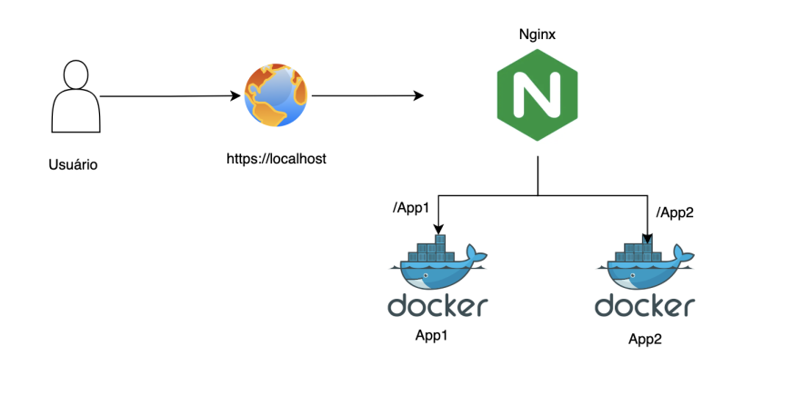

# Sistema Web com Docker e Reverse Proxy

## Descrição
Este projeto foi desenvolvido como parte de um desafio DevOps.
O objetivo é containerizar duas aplicações web simples e configurar um reverse proxy com Nginx para rotear o tráfego entre elas.

Toda a soluçao foi implementada via Docker Compose, expondo apenas a porta 80/443 (HTTP/HTTPS) .

## Como executar o projeto

    git clone https://github.com/ThainaSantoss/Desafio-DevOps.git
    cd Desafio-DevOps
    docker compose up
    
 Acesse no navegador: 
-   [http://localhost/](http://localhost/) → página inicial
-   [http://localhost/app1](http://localhost/app1) → aplicação 1
-   [http://localhost/app2](http://localhost/app2) → aplicação 2

## Tecnologias Utilizadas 
- Docker
- Docker Compose
- Nginx 
- Python
- Open SSL
- Makefile

## Arquitetura da Solução 

## Decisões Técnicas 
- Python + Flask: escolhido por ser simples para páginas HTML.
- Nginx como proxy reverse: facilidade de configuração.
- Healthchecks:  garante que todos os serviços sejam considerados saudáveis.
- Makefile: criado para comandos frequentes e simplificar a execução do projeto.
- SSL: simula um ambiente com HTTPS.

## Dificuldades Encontradas 
- O healthceck dos apps falhava pois o curl não estava presente nos containers, a solução foi utilizar o wget para realizar o healthcheck.
- O https não subiu inicialmente, a solução foi corrigir o path dos certificados no compose e no nginx.conf.

## Oque eu Aprendi 
- Como implementar múltiplos serviços com o Docker Compose.
- A importância do reverse proxy para centralizar o tráfego e organizar rotas.
- Uso de healthchecks para monitoramento contínuo.
- Como aplicar boas práticas e segurança em um ambiente Docker.
- Ultilização de certificado SSL.

## Melhoria Futuras 
- Usar certificado do Let's Encrypt.
- Fazer Deploy na AWS. 
- Utilizar Kubernetes.
- Criar uma pipeline de CI/CD.